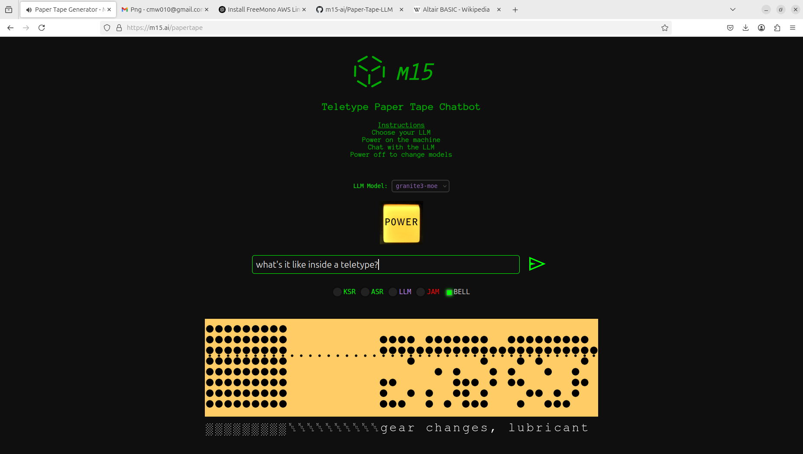

# Teletype Paper Tape Chatbot

Inspired by the 50th anniversary of Microsoft, I vibe coded a working teletype paper tape chatbot.  

First, the computer my dad built and the original Micro-soft MITS bootstrap loader paper tape for Altair 4k BASIC:

[insert pic]

Introducing a retro-futuristic terminal interface that simulates a 1979 Teletype Model 33 ASR — powered by modern LLMs via Ollama. Generates animated, audio-punched paper tape output for your prompts. Powered on/off with sound effects and glowing LEDs.

## Screenshot



## Features

- Vintage lighted POWER button with startup/shutdown SFX + glow
- Screen shake when turning on or off (retro current surge effect)
- Realistic 8-level paper tape recreation
- Clicky punch sounds and motor hum synced to paper tape movement
- Paper tape scrolls in real-time with ASCII output
- LLM selector (Qwen, TinyDolphin, Granite3-MoE)
- LED indicators for KSR (keyboard) / ASR (tape) / LLM / JAM status LEDs
- EOL BELL support (ASCII `BEL` shown + ding audio)
- `BEL` glyph shown visually on tape
- ASCII accurate PNG rendering of punched tape, rendered by `matplotlib`

- LLM integration (multi-model via Ollama API)
- Models supported: `qwen2.5:0.5b`, `tinydolphin`, `granite3-moe`
- System prompt identifies the LLM as a Teletype Model 33 ASR (1979)
- Lightweight models run locally with fast, lightweight footprint`
- Proper header/footer hex codes (#FF, #00)
- Tape Jam is simulated if input text or LLM response is too large

## Requirements

- Python 3
- Flask
- Matplotlib
- Ollama with supported models (`qwen2.5:0.5b`, `tinydolphin`, etc.)

## Setup

#### Clone the repo

Blah

```
pip install flask matplotlib requests
```

Blah

#### Install dependencies:

```
pip install flask matplotlib requestsRun Ollama locally
```

Install [Ollama](https://ollama.com) and pull one or more models:
```bash
ollama pull qwen2.5:0.5b
ollama pull tinydolphin
ollama pull granite3-moe:1b
```

Blah


#### Start the Flask server

Place the server in a non-public directory:

```
[ec2-user@ip-xxx ~]$ pwd
/home/ec2-user
[ec2-user@ip-xxx ~]$ ls -lsart
total 18
 0 drwxr-xr-x. 3 ec2-user ec2-user    75 Apr 16 20:43 .ollama
 8 -rw-rw-r--. 1 ec2-user ec2-user  7461 Apr 17 17:44 papertape_server.py
 4 -rw-r--r--. 1 ec2-user ec2-user  2305 Apr 17 20:33 server.log
[ec2-user@ip-172-31-56-10 ~]$ 
```

Run the server so it will persist:

```
nohup python3 papertape_server.py > server.log 2>&1 &
```

Blah

#### Install the Front-end assets

Place the `papertape.html` file, the `*.mp3` sound files, and the `*.png` images into a public directory:

```
[ec2-user@ip-xxx html]$ pwd
/var/www/html
[ec2-user@ip-xxx html]$ ls -lsart
total 63
  0 drwxr-xr-x. 4 root     root         33 Dec 16 23:12 ..
  4 -rw-rw-r--. 1 ec2-user ec2-user    743 Apr 13 20:37 send_48dp_green.png
 60 -rw-rw-r--. 1 ec2-user ec2-user  59755 Apr 16 01:54 tt-starting.mp3
192 -rw-rw-r--. 1 ec2-user ec2-user 193920 Apr 16 01:55 tt-running.mp3
136 -rw-rw-r--. 1 ec2-user ec2-user 136242 Apr 16 01:55 tt-stopping.mp3
 16 -rw-rw-r--. 1 ec2-user ec2-user  13503 Apr 16 02:42 ttclick4.mp3
 40 -rw-rw-r--. 1 ec2-user ec2-user  37601 Apr 16 04:07 button-on.png
 36 -rw-rw-r--. 1 ec2-user ec2-user  35713 Apr 16 04:07 button-off.png
 48 -rw-rw-r--. 1 ec2-user ec2-user  46982 Apr 16 17:28 ding.mp3
 16 drwxr-xr-x. 2 ec2-user ec2-user  16384 Apr 16 17:28 .
 20 -rw-rw-r--. 1 ec2-user ec2-user  17540 Apr 17 18:19 papertape.html
```

Blah

#### Serve the HTML page

Run the server so it will persist:

```
nohup python3 papertape_server.py > server.log 2>&1 &
```

Blah

Use any web server (e.g., Apache, Nginx, or Python HTTP):

```
python3 -m http.server
```

Blah

## Notes

- Tested on desktop and mobile
- Models run offline — no external API calls

## License

MIT — for the retro hacker in all of us.

