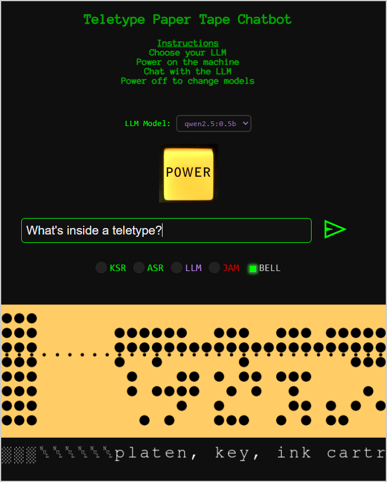

# Teletype Paper Tape Chatbot

Inspired by the 50th anniversary of Microsoft, I vibe coded a working teletype paper tape chatbot.  

Introducing a retro-futuristic terminal interface that simulates a 1979 Teletype Model 33 ASR — powered by modern LLMs via Ollama. Generates animated, audio-punched paper tape output for your prompts. Powered on/off with sound effects and glowing LEDs.

## Screenshot



## Features

- Vintage lighted POWER button with startup/shutdown SFX + glow
- Screen shake when turning on or off (retro current surge effect)
- Realistic 8-level paper tape recreation
- Clicky punch sounds and motor hum synced to paper tape movement
- Paper tape scrolls in real-time with ASCII output
- LLM selector (Qwen, TinyDolphin, Granite3-MoE)
- LED indicators for KSR (keyboard) / ASR (tape) / LLM / JAM status LEDs
- EOL BELL support (ASCII `BEL` shown + ding audio)
- `BEL` glyph shown visually on tape
- ASCII accurate PNG rendering of punched tape, rendered by `matplotlib`

- LLM integration (multi-model via Ollama API)
- Models supported: `qwen2.5:0.5b`, `tinydolphin`, `granite3-moe`
- System prompt identifies the LLM as a Teletype Model 33 ASR (1979)
- Lightweight models run locally with fast, lightweight footprint
- Proper header/footer hex codes (#FF, #00)
- Tape Jam is simulated if input text or LLM response is too large

## Requirements

- Python 3
- Flask
- Matplotlib
- Ollama with supported models (`qwen2.5:0.5b`, `tinydolphin`, etc.)

## Setup

I setup my server on Amazon AWS Linux. Adjust accordingly for your environment.

#### Clone the repo

To get started, clone the project from GitHub:

```
git clone https://github.com/m15-ai/Paper-Tape-LLM.git
cd Paper-Tape-LLM
```

#### Install dependencies:

```
pip install flask matplotlib
```

#### Run Ollama locally

Install `Ollama` for your platform, then pull one or more supported models:

```bash
ollama pull qwen2.5:0.5b
ollama pull tinydolphin
ollama pull granite3-moe:1b
```

Make sure the Ollama daemon is running in the background. Use `Ollama list` to confirm your models are available:

```
[ec2-user@ip-xxx html]$ ollama serve
[ec2-user@ip-xxx html]$ ollama list
NAME                   ID              SIZE      MODIFIED     
granite3-moe:1b        d84e1e38ee39    821 MB    25 hours ago    
tinydolphin:latest     0f9dd11f824c    636 MB    25 hours ago    
qwen2.5:0.5b           a8b0c5157701    397 MB    25 hours ago
```


#### Start the Flask server

Place the server in a non-public directory:

```
[ec2-user@ip-xxx ~]$ pwd
/home/ec2-user
[ec2-user@ip-xxx ~]$ ls -lsart
total 18
 0 drwxr-xr-x. 3 ec2-user ec2-user    75 Apr 16 20:43 .ollama
 8 -rw-rw-r--. 1 ec2-user ec2-user  7461 Apr 17 17:44 papertape_server.py
 4 -rw-r--r--. 1 ec2-user ec2-user  2305 Apr 17 20:33 server.log
[ec2-user@ip-172-31-56-10 ~]$ 
```

Run the server so it will persist:

```
nohup python3 papertape_server.py > server.log 2>&1 &
```

This will expose the `/generate_paper_tape` endpoint.

#### Install the Front-end assets

Place the `papertape.html` file, the `*.mp3` sound files, and the `*.png` images into a public directory:

```
[ec2-user@ip-xxx html]$ pwd
/var/www/html
[ec2-user@ip-xxx html]$ ls -lsart
total 63
  0 drwxr-xr-x. 4 root     root         33 Dec 16 23:12 ..
  4 -rw-rw-r--. 1 ec2-user ec2-user    743 Apr 13 20:37 send_48dp_green.png
 60 -rw-rw-r--. 1 ec2-user ec2-user  59755 Apr 16 01:54 tt-starting.mp3
192 -rw-rw-r--. 1 ec2-user ec2-user 193920 Apr 16 01:55 tt-running.mp3
136 -rw-rw-r--. 1 ec2-user ec2-user 136242 Apr 16 01:55 tt-stopping.mp3
 16 -rw-rw-r--. 1 ec2-user ec2-user  13503 Apr 16 02:42 ttclick4.mp3
 40 -rw-rw-r--. 1 ec2-user ec2-user  37601 Apr 16 04:07 button-on.png
 36 -rw-rw-r--. 1 ec2-user ec2-user  35713 Apr 16 04:07 button-off.png
 48 -rw-rw-r--. 1 ec2-user ec2-user  46982 Apr 16 17:28 ding.mp3
 16 drwxr-xr-x. 2 ec2-user ec2-user  16384 Apr 16 17:28 .
 20 -rw-rw-r--. 1 ec2-user ec2-user  17540 Apr 17 18:19 papertape.html
```

#### Serve the HTML page

After launching the Flask backend, open `papertape.html` directly in your browser (e.g., from your `/var/www/html` or localhost folder). The HTML will communicate with the backend to generate paper tape completions.

#### HTML Overview (`papertape.html`)

This file contains the fully retro-styled frontend interface:

- **Power Switch**: A clickable image button (`button-on.png`, `button-off.png`) that powers the teletype on/off. Triggers startup and shutdown audio, screen shake, and LED activation.
- **Text Input & Submit Button**: A styled text input box and a green send icon (`send_48dp_green.png`) that submits prompts to the server.
- **LLM Selector**: A dropdown menu lets users select which local Ollama model to use. Locked while power is on.
- **LED Panel**: Simulated KSR, ASR, LLM, and JAM status lights that activate based on interaction state.
- **BELL Toggle**: Checkbox enabling the inclusion of ASCII `BEL` (U+0007) in the final tape and triggering a physical bell sound (`ding.mp3`).
- **Paper Tape Scroll**: Receives a PNG tape image from the server and scrolls it across the screen in "chunky" increments, synchronized with retro click sounds (`ttclick4.mp3`).
- **Audio Feedback**: Three hum sounds (`tt-starting.mp3`, `tt-running.mp3`, `tt-stopping.mp3`) create a realistic audio profile for machine state.
- **Tape JAM Handling**: Detects long input or LLM output, shows a JAM LED, and aborts the scroll sequence.

#### Python Backend Overview (`papertape_server.py`)

This Flask server powers the paper tape simulation and LLM interaction:

- **Endpoint `/generate_paper_tape`**: Accepts a POST JSON payload containing:
  - `text`: the user prompt
  - `bell`: boolean indicating if the `BEL` character should be added
  - `model`: the selected LLM model (e.g. `qwen2.5:0.5b`)
- **LLM Request Handling**:
  - Sends the prompt to the Ollama server using the selected model
  - Prepends a system message simulating a 1979 Teletype terminal
- **Tape Rendering**:
  - Converts the LLM completion string to 8-bit ASCII punch codes
  - Adds leader (`0xFF`) and trailer (`0x00`) bytes
  - Optionally appends `BEL` as a visible glyph
  - Uses `matplotlib` to render a PNG of the full tape
- **Returns**:
  - The PNG image via `send_file()`
  - A custom HTTP header (`X-Punch-Count`) with the total character count for frontend animation sync

#### Customizing the System Prompt

The system message sent to each model tells it to behave like a 1979 Teletype terminal. You can modify this string in `papertape_server.py` to adjust tone, length, or formatting of LLM responses.

```
@app.route('/generate_paper_tape', methods=['POST'])
def generate_tape():
    system_prompt = (
        "You are a Teletype Model 33 ASR from the year 1979, connected to a mainframe via serial cable. "
        "You respond in short bursts of uppercase text as if printed on a paper tape. "
        "Your language is efficient, mechanical, and dry. Limit output to a few words per line, "
        "like a real teletype outputting ASCII on paper tape. "
        "Avoid punctuation unless absolutely necessary. Never apologize or explain. "
    )
```

## Inspiration

The computer my dad built and the original Micro-soft MITS Altair 4k BASIC bootstrap loader paper tape. That's where it all started for me:


## Notes

- Tested on desktop and mobile
- Models run offline — no external API calls

## License

MIT — for the retro hacker in all of us.

